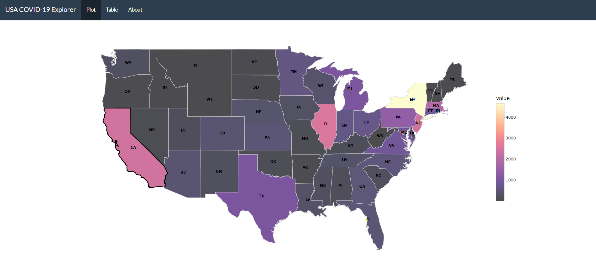

# covidexplorer
<!-- badges: start -->
<!-- badges: end -->

The goal of `covidexplorer` package is to provide users with insights of the spread of COVID-19 in the US through interactive plots and table. The package allows users to launch a Shiny app called USA COVID-19 Explorer. Through this app, users will be able to see the trend of COVID-19 infections across states in the US over time. In addition to selecting preferred stats in a specific date range, the app also allows users to choose daily or cumulative numbers of a number of variable of interests to be shown in the plots and table:

* Confirmed cases
* Deaths
* Test
* Recovered

In addition to the USA COVID-19 Explorer app, `covidexplorer` package also contains three datasets: 

* `covid`: contains USA COVID-19 data at State level from 2020-01-12 to 2020-10-21.
* `usa_map`: contains necessary data to draw geographical map of the US.
* `state_list`: contains a list of the centroids coordinates of each states in the US.

## Installation

You can install the `covidexplorer` package with:

``` r
devtools::install_github("etc5523-2020/r-package-assessment-j-effendy")
```

## Example

This is how you can use the `covidexplorer` package to launch USA COVID-19 Explorer app:

``` r
library(covidexplorer)
# Launching the USA COVID-19 Explorer app
launch_app()
```



## Vignette

The vignette for this package can be found at [GitHub](https://etc5523-2020.github.io/r-package-assessment-j-effendy/)