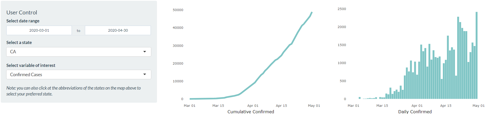

```{r, include = FALSE}
knitr::opts_chunk$set(
  collapse = TRUE,
  comment = "#>"
)
```

```{r setup}
library(covidexplorer)
library(knitr)
library(here)
```

## What is USA COVID-19 Explorer app?

The goal of `covidexplorer` package is to provide users with insights of the spread of COVID-19 in the US through interactive plots and table. The package allows users to launch a Shiny app called USA COVID-19 Explorer. Through this app, users will be able to see the trend of COVID-19 infections across states in the US over time. In addition to selecting preferred stats in a specific date range, the app also allows users to choose daily or cumulative numbers of a number of variable of interests to be shown in the plots and table:

* Confirmed cases
* Deaths
* Test
* Recovered

## How to Launch USA COVID-19 Explorer

Firstly, the package needs to be installed to use the USA COVID-19 Explorer app.

You can use the following code to install the app:

``` r
devtools::install_github("etc5523-2020/r-package-assessment-j-effendy")
```

After installing the package, you can launch the app with the following codes:

``` r
library(covidexplorer)
# Launching the USA COVID-19 Explorer app
launch_app()
```

## How to use USA COVID-19 Explorer

### Plot Page

Once the library is loaded, and the `launch_app()` function is run,
the app will be launched, and it will take you to the `Plot` page.
This page provides users with three plots/graphs:

* Map plot: contains the map of the USA where each states are color coded 
based on daily cases of the chosen parameters.
* Cumulative line plot: presents cumulative number of cases specified 
parameters over a specified period of time.
* Daily line plot: presents cumulative number of cases specified 
parameters over a specified point in time.


```{r homepage, fig.cap="USA COVID-19 Explorer Plot Page", out.width="100%"}
knitr::include_graphics("man/figures/map.PNG")
```

At the bottom of the `Plot` page, you can see `User Control` section
that allows users to choose desired parameters to be shown by the plots:

* Date range: ranging from 1st of March to 7th of October 2020.
* State: a list of states in the US.
* Variable of interest: number of confirmed cases, deaths, tests, and recovered.

Users can also select desired state by clicking the name (abbreviation) of the state in the 
map plot. Please note that the app will crash if users click outside the name of the state.

```{r plots, fig.cap="Daily and Cumulative Cases Plots", out.width="100%"}

```

### Table Page

The `Table` page provides an interactive table that presents the number of cases of
a specified parameters for each states in the US. Users are able to select the value
of the following variables to be presented in the table:

* Date range: ranging from 1st of March to 7th of October 2020.
* Statistics: daily or cumulative
* Variable of interest: number of confirmed cases, deaths, tests, and recovered.

This table can be customised based on users' preferences. For instance, it can be sorted
by the number of cases. In addition, it lets users to select how many entries to be
shown in the table.

```{r table, fig.cap="USA COVID-19 Explorer Table Page", out.width="100%"}

```